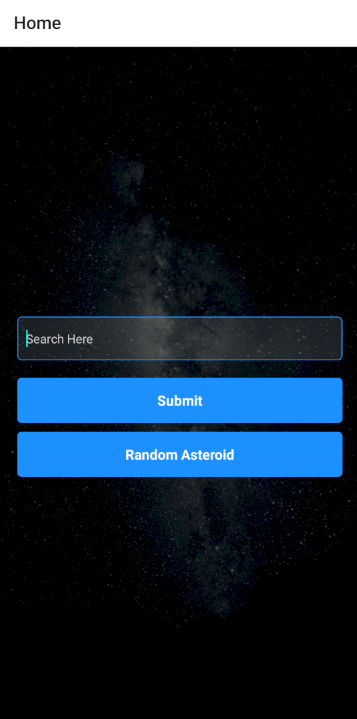
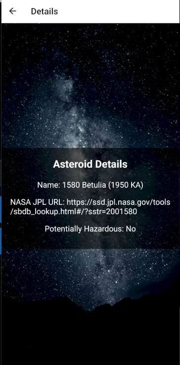

# Fullstack Assignment 3

## Screenshots





## Setup Instructions

1. Copy the `config.ts.example` file to `config.ts`:
   ```sh
   cp config.ts.example config.ts
   ```
2. Add your api key
3. ```sh
   npm install
   ```
4. ```sh
   npx expo start
   ```
